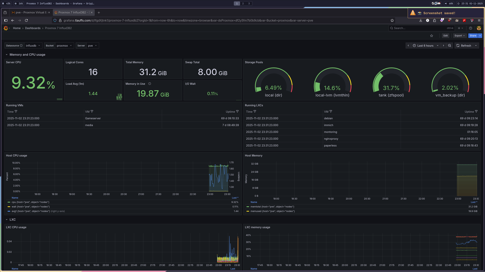

# Monitoring
- run ansible playbook to setup monitoring
    - run `ansible-playbook -i ansible/inventory/hosts.ini ansible/playbook.yml --ask-become-pass -l monitoring_lxc`
    - setup influxdb via web ui
- add metrics server in proxmox
    - Datacenter > Metrics > Add InfluxDB
    - see [proxmox wiki](https://pve.proxmox.com/wiki/External_Metric_Server)
- add grafana datasource
    - add influxdb source
        - change query language to flux
        - host: http://influxdb:8086
- add dashboards
    - [proxmox dashboard](https://grafana.com/grafana/dashboards/18621-proxmox-7-influxdb2/)
    - [proxmox dashboard alt](https://grafana.com/grafana/dashboards/15356-proxmox-cluster-flux/)

